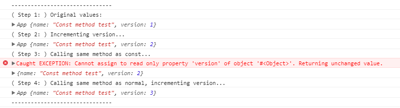

### Const methods in JavaScript

This is an experiment to mimic the behaviour of const methods in C++. 

When a function is called with the `callAsConst` extension method, it has read-only access to the instance (object properties become immutable). When an attempt is made to write to a property, an exception is thrown. 

```javascript
<Function>.callAsConst(<Target>);

myObj.method.callAsConst(myObj);
```

Output from [sample application](const-method-test.html):


